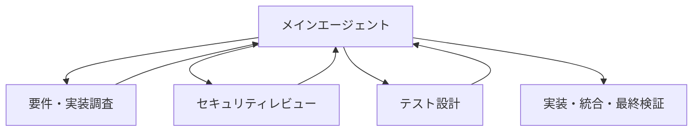

# 開発ひな型レポジトリ

Webサービス開発プロジェクトで使う各種資料のひな型（テンプレート）をまとめたレポジトリです。
企画からリリース後の振り返りまで、開発プロジェクトの一連の流れに沿った資料一式をすぐに使える形で用意しています。

## 構成

| フォルダ | 内容 |
| --- | --- |
| [pj-docs/](pj-docs/) | 開発資料ひな型一式（企画書〜リリース後振り返り） |
| [docs/](docs/) | GitHub Pages公開用のソースコード格納フォルダ |

> 通常、ソースコードは `src/` に置くことが多いですが、本レポジトリでは GitHub Pages の公開元フォルダとして `main` ブランチの `/docs` を指定できる仕様に合わせて、`docs/` をソースフォルダとして採用しています。

## docsについて（GitHub Pages）

`docs/` 配下は GitHub Pages でそのまま公開されるサンプルサイトです。JavaScriptによる簡易インタラクション付きの Hello World ページを用意しています。

| ファイル/フォルダ | 内容 |
| --- | --- |
| [docs/index.html](docs/index.html) | サンプルページ本体 |
| [docs/style.css](docs/style.css) | スタイル定義 |
| [docs/script.js](docs/script.js) | 挨拶を切り替えるインタラクション用スクリプト |
| [docs/images/](docs/images/) | ページで使用する画像（SVG） |

公開する場合は、リポジトリの Settings → Pages で Source を `main` ブランチ / `/docs` フォルダに設定してください。

## pj-docsについて

チーム向けタスク管理Webサービス「TaskFlow」を題材にした、開発プロジェクトの標準資料テンプレート集です。

- 企画書 / 概要書（スライド形式）
- 要件定義書
- キックオフ資料（収益予測含む）
- 内部設計書 / 外部設計書
- コーディング規約（Playwright等テストツール含む）
- 製品完成物レビュー資料（スライド形式）
- 外部テスト計画書 / テストチェックリスト
- 出荷物認証資料（出荷物一覧・リリース計画書含む）
- リリース後振り返り

各資料の詳細・使い方・PDF化手順は [pj-docs/README.md](pj-docs/README.md) を参照してください。

## AIを活用した構築

本レポジトリでは、GitHub Copilotを設計・実装・テスト・ドキュメント作成の補助に利用できます。AIは作業を速くするための支援役であり、要件・設計・セキュリティ・品質の最終判断は開発チームが行います。

### 基本手順

1. 対象資料と目的を明確にし、関連する要件・設計・制約をCopilotに伝える。
2. 変更範囲、完了条件、テスト方法を指定して、実装案または資料案を作成させる。
3. 提案内容を既存コード・資料・規約と照合し、必要な修正を加える。
4. テスト、Lint、ビルド、レビューを実施してから確定する。

### GitHub Copilot利用例

VS CodeのGitHub Copilot Chatで、次のように依頼します。

```text
TaskFlowの要件定義書と外部設計書を確認してください。
タスク作成APIの実装案を、既存の命名規約・認可方針・エラーハンドリング方針に合わせて提案してください。
変更対象ファイル、実装理由、単体テストとPlaywrightのE2Eテスト案も示してください。
不明な点は推測せず、確認事項として列挙してください。
```

実装後は次のように検証を依頼できます。

```text
今回の変更について、要件漏れ、認可不備、入力検証不足、既存機能への回帰リスクを優先してレビューしてください。
問題があればファイル名と該当箇所、再現条件、修正案を示してください。
```

機密情報・認証情報・個人情報・本番データはプロンプトやソースコードに入力しないでください。AIが生成したコードや文章は、必ず人が内容を確認し、実行可能なテストで検証してください。

## GitHub Copilotのプロジェクト設定

GitHub Copilot向けの設定を、用途に応じて2種類に分けています。

- [.github/copilot-instructions.md](.github/copilot-instructions.md)：このリポジトリで常に適用するルール。コーディング規約の確認、機密情報の扱い、テスト・レビューの実施などを定義。
- [.github/skills/webapp-project-builder/SKILL.md](.github/skills/webapp-project-builder/SKILL.md)：必要なときに呼び出す構築ワークフロー。資料確認から実装、Playwright、検証までの手順と依頼例を定義。

つまり、コーディング規約を毎回読ませる基本方針は `copilot-instructions.md` に置き、機能実装や資料作成を段階的に進める詳しい流れは `SKILL.md` に置いています。

VS CodeのGitHub Copilot Chatでは、通常の依頼で常時ルールが適用されます。構築ワークフローを明示的に使う場合は `webapp-project-builder` を呼び出してください。

### GitHub Copilot依頼例

#### 機能実装

```text
コーディング規約を先に読み、要件定義書F-004と外部設計書API-004に基づいてタスク作成機能を実装してください。
既存の構成と命名規約を維持し、変更対象を最小限にしてください。
入力検証、認可チェック、エラーハンドリング、単体テスト、PlaywrightのE2Eテストを含めてください。
仕様が不足している点は推測せず、確認事項として列挙してください。
```

#### ドキュメント作成

```text
コーディング規約と要件定義書を確認し、総合テスト計画書の不足している項目を整理してください。
既存の章立てと用語を維持し、確定していない数値は推測せず[要確認]として残してください。
該当しない項目は「該当なし」と記載してください。
```

#### 変更レビュー

```text
今回の変更を、要件・外部設計・内部設計との整合性、セキュリティ、例外処理、性能、アクセシビリティ、回帰リスク、テスト不足の順にレビューしてください。
重大度の高い問題から、ファイル名、該当箇所、理由、修正案を示してください。
問題がない観点は「問題なし」と明記してください。
```

### サブエージェント利用例

GitHub Copilotのサブエージェントには、メイン作業から切り離せる調査やレビューを依頼できます。たとえば、次のように依頼します。

#### 利点

- 既存コードの探索や観点別レビューを並行して進められる。
- 要件、セキュリティ、テストなどの専門的な観点を分担できる。
- 調査を読み取り専用に指定して、実装前の影響範囲を安全に把握できる。
- メインエージェントだけでは見落としやすい観点を、別のエージェントから確認できる。

#### 注意点

- サブエージェントの結果は必ず実ファイルと照合する。
- 目的、対象範囲、参照資料、調査の深さ、出力形式を明示する。
- エージェントを増やすほど、各コンテキスト・会話・結果の分だけトークン消費が増える。小さな作業では使わず、担当範囲を重複させない。
- 長い会話や修正の繰り返しはトークン消費と処理時間を増やすため、調査結果は要点に絞る。
- サブエージェントを増やす前に、1つのエージェントで完結できないか確認する。並列化してもトークン消費が減るとは限らない。
- 同じファイルを複数エージェントに同時編集させず、編集はメインエージェントに集約する。
- 機密情報・認証情報・個人情報・本番データを渡さない。
- 最終的な設計判断、テスト結果の確認、承認責任は開発担当者が持つ。

#### 回数制限の管理

修正・再レビューの最大回数は、チャットごとの口約束にせず、`.github/copilot-instructions.md` などの常時適用ルールへ必ず記載します。このプロジェクトでは最大2回とし、解決しない問題はメインエージェントへ報告します。

```text
Exploreサブエージェントで、タスク作成機能に関係する画面、API、既存テストを調査してください。
コーディング規約と要件定義書F-004を確認し、コードは変更しないでください。
結果はファイルパス、シンボル、役割、実装時の注意点に分けて返してください。
```

#### 例：観点別レビューの分担

```text
2つのサブエージェントに分担させてください。
Aは要件定義書・外部設計書との整合性、Bは認可・入力検証・機密情報の扱いをレビューしてください。
どちらもコードは変更せず、重大度の高い順にファイルパス、該当箇所、理由、修正案を返してください。
最後にメインエージェントが結果を統合し、必要な修正とテストを行ってください。
修正・再レビューは最大2回までとし、解決しない問題はメインエージェントへ報告してください。
```

#### 例：テスト観点の洗い出し

```text
Exploreサブエージェントで、タスク作成機能のテスト観点を洗い出してください。
正常系、入力エラー、権限エラー、境界値、回帰リスクを分類し、既存のPlaywrightテストとの重複も確認してください。
テストコードは変更せず、テストケース一覧と不足している観点だけを返してください。
```

サブエージェントの結果はそのまま採用せず、メインエージェントが実ファイルと照合してから実装・テストを行います。詳細な構築手順は [webapp-project-builder Skill](.github/skills/webapp-project-builder/SKILL.md) を参照してください。

### マルチエージェント構成

複数のサブエージェントを使う場合は、メインエージェントを司令塔にして、役割ごとに依頼する構成を推奨します。サブエージェント同士を自由に会話させるより、調査結果やレビュー結果を構造化して受け渡す方が、重複・認識違い・無限ループを抑えられます。



#### 役割分担の例

| 担当 | 役割 | 編集可否 |
| --- | --- | --- |
| メインエージェント | 依頼分解、結果統合、実装、最終判断 | 可 |
| 調査エージェント | 既存コード、要件、影響範囲の確認 | 原則不可 |
| セキュリティ担当 | 認証・認可、入力検証、機密情報の確認 | 原則不可 |
| テスト担当 | 単体テスト、Playwright、回帰観点の整理 | 原則不可 |

#### 連携時の依頼例

```text
メインエージェントとして、タスク作成機能の変更を次の3担当に分担してください。

1. 調査担当：画面、API、データモデル、既存テストを確認する
2. セキュリティ担当：認可、入力検証、機密情報の扱いを確認する
3. テスト担当：正常系、異常系、境界値、Playwrightの不足ケースを確認する

各担当はコードを変更せず、次の形式で結果を返してください。
- 結論
- 根拠となるファイルパスとシンボル
- 問題点
- 未確認事項
- メインエージェントへの引き継ぎ事項

結果を統合した後、コーディング規約に従って実装し、テストとビルドを実行してください。
修正・再レビューが必要な場合は最大2回までとし、解決しない問題はメインエージェントへ報告してください。
```

サブエージェント間で修正と再レビューを行う場合は、担当範囲と回数上限を決めます。たとえば「修正・再レビューは最大2回、解決しない問題はメインエージェントへ報告」とします。本番環境への操作や不可逆な変更はサブエージェントに任せず、担当者が最終確認してください。

## 使い方

1. [pj-docs/](pj-docs/) 配下の該当フォルダから `.md` ファイルを実プロジェクト用にコピーする。
2. 資料冒頭の「本資料はテンプレートです」の注意書きを削除し、内容を実情報に置き換える。
3. `[ ]` のプレースホルダー項目を埋め、該当しない項目には「該当なし」と記載する。
