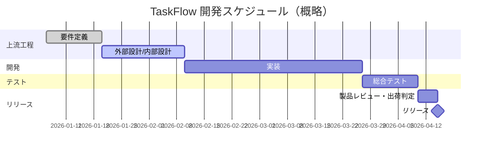

# キックオフ資料

> ⚠️ **本資料はテンプレート（雛形）です。** 内容を変更して資料作成を開始する際は、このメッセージを削除してください。該当しない項目には「該当なし」と記載してください。

| 項目 | 内容 |
| --- | --- |
| プロジェクト名 | TaskFlow |
| 開催日 | [YYYY/MM/DD] |
| 参加者 | [氏名一覧 / 部署] |
| 関連資料 | [企画書](../01_proposal/proposal.md)、[要件定義書](../02_requirements/requirements.md) |

## 1. プロジェクト概要

- チーム向けタスク管理Webサービス「TaskFlow」の新規開発プロジェクト。
- リリース予定日：[YYYY/MM/DD]

## 2. プロジェクトゴール

| ゴール | 指標 |
| --- | --- |
| MVPリリース | [YYYY/MM/DD]までにMust要件を満たしてリリース |
| 初期ユーザー獲得 | リリース後3ヶ月で有料契約[X]件 |
| 品質確保 | 重大バグ0件でのリリース |

## 3. 体制・役割

| 役割 | 担当 | 責任範囲 |
| --- | --- | --- |
| プロジェクトオーナー | [氏名] | 意思決定・予算 |
| プロジェクトマネージャー | [氏名] | 進捗・課題管理 |
| テックリード | [氏名] | 技術方針・設計レビュー |
| 開発（フロントエンド） | [氏名] x[N] | 画面実装 |
| 開発（バックエンド） | [氏名] x[N] | API・DB実装 |
| QA | [氏名] x[N] | テスト計画・実施 |
| デザイナー | [氏名] | UI/UXデザイン |

## 4. スケジュール（マイルストーン）

## 5. コミュニケーション計画

| 会議体 | 頻度 | 参加者 | 目的 |
| --- | --- | --- | --- |
| 定例会議 | 週次 | 全メンバー | 進捗確認・課題共有 |
| 設計レビュー | 都度 | テックリード, PM | 設計品質確認 |
| 製品レビュー | マイルストーン毎 | 全体 | 出荷判定 |

## 6. 収益予測

### 6.1 前提条件

| 項目 | 値 |
| --- | --- |
| 想定プラン単価（Standard） | [¥X / ユーザー / 月] |
| 想定プラン単価（Pro） | [¥Y / ユーザー / 月] |
| 無料→有料転換率 | [X]% |
| 解約率（月次） | [X]% |

### 6.2 収益予測（3年間）

| 年度 | 新規契約数 | 累計契約数 | 月間経常収益（MRR） | 年間経常収益（ARR） |
| --- | --- | --- | --- | --- |
| 1年目 | [件] | [件] | [金額] | [金額] |
| 2年目 | [件] | [件] | [金額] | [金額] |
| 3年目 | [件] | [件] | [金額] | [金額] |

### 6.3 コスト・損益分岐点

| 項目 | 年間金額目安 |
| --- | --- |
| 開発・保守人件費 | [金額] |
| インフラ費用 | [金額] |
| マーケティング費用 | [金額] |
| 損益分岐点（BEP） | [YYYY年MM月頃 / 累計契約数X件] |

> 数値は仮置きです。実プロジェクトでは市場調査・営業計画に基づき精緻化してください。

## 7. リスクと対応

| リスク | 影響 | 対応策 | オーナー |
| --- | --- | --- | --- |
| 開発遅延 | リリース延期 | スコープ調整、優先度見直し | PM |
| 要員不足 | 品質低下 | 早期の増員計画 | PM |
| セキュリティ事故 | 信頼失墜 | 総合テスト・脆弱性診断実施 | テックリード |

## 8. アクションアイテム

| No | アクション | 担当 | 期限 |
| --- | --- | --- | --- |
| 1 | 開発環境構築 | [氏名] | [YYYY/MM/DD] |
| 2 | 外部設計書レビュー日程調整 | PM | [YYYY/MM/DD] |
