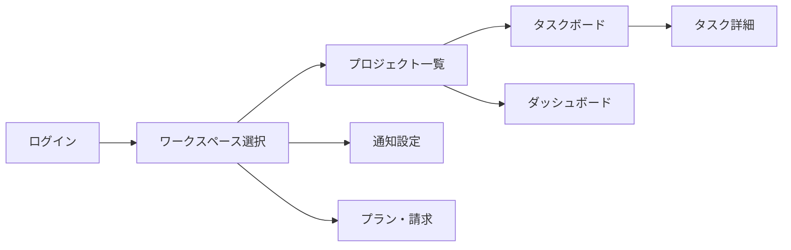

# 外部設計書

> ⚠️ **本資料はテンプレート（雛形）です。** 内容を変更して資料作成を開始する際は、このメッセージを削除してください。該当しない項目には「該当なし」と記載してください。

| 項目 | 内容 |
| --- | --- |
| プロジェクト名 | TaskFlow |
| 作成日 | [YYYY/MM/DD] |
| 版数 | v0.1 |
| 関連資料 | [要件定義書](../02_requirements/requirements.md)、[内部設計書](../05_internal-design/internal-design.md) |

## 1. 目的

ユーザーから見える画面仕様・外部インターフェース仕様を定義し、開発・テストの基準とする。

## 2. 画面一覧

| 画面ID | 画面名 | 概要 | 関連機能ID |
| --- | --- | --- | --- |
| SC-01 | ログイン画面 | メール/パスワード、SSOログイン | F-001 |
| SC-02 | ワークスペース選択画面 | 所属ワークスペース一覧 | F-002 |
| SC-03 | プロジェクト一覧画面 | プロジェクトのカード/リスト表示 | F-003 |
| SC-04 | タスクボード画面 | カンバン形式のタスク管理 | F-004, F-005 |
| SC-05 | タスク詳細モーダル | タスク詳細、コメント、添付 | F-004, F-006 |
| SC-06 | ダッシュボード画面 | 進捗グラフ、バーンダウンチャート | F-008 |
| SC-07 | 通知設定画面 | 通知条件のON/OFF | F-007 |
| SC-08 | プラン・請求画面 | プラン変更、請求情報確認 | F-010 |

## 3. 画面遷移図



## 4. 画面設計（例：SC-04 タスクボード画面）

| 項目 | 内容 |
| --- | --- |
| 概要 | ステータス別（未着手/対応中/完了）にタスクをカンバン表示 |
| 入力項目 | フィルタ（担当者/期限/タグ） |
| 操作 | ドラッグ&ドロップでステータス変更、タスクカードクリックで詳細表示 |
| バリデーション | ステータス変更時の権限チェック |
| 表示条件 | 権限のないユーザーは編集不可（閲覧のみ） |

## 5. 外部インターフェース（API）概要

| API ID | メソッド | パス | 概要 |
| --- | --- | --- | --- |
| API-001 | POST | /api/auth/login | ログイン |
| API-002 | GET | /api/workspaces | ワークスペース一覧取得 |
| API-003 | GET | /api/projects | プロジェクト一覧取得 |
| API-004 | POST | /api/projects/{id}/tasks | タスク作成 |
| API-005 | PATCH | /api/tasks/{id} | タスク更新（ステータス等） |
| API-006 | GET | /api/dashboard/summary | ダッシュボード集計取得 |

### 5.1 API詳細（例：API-004 タスク作成）

**リクエスト**

```json
{
  "title": "string (required, max 255)",
  "assigneeId": "uuid (optional)",
  "dueDate": "date (optional, ISO8601)",
  "description": "string (optional)"
}
```

**レスポンス（201）**

```json
{
  "id": "uuid",
  "title": "string",
  "status": "todo",
  "assigneeId": "uuid",
  "dueDate": "date",
  "createdAt": "timestamp"
}
```

**エラーレスポンス**

| ステータス | 条件 |
| --- | --- |
| 400 | タイトル未入力等 |
| 403 | プロジェクトへのアクセス権限なし |
| 404 | プロジェクトが存在しない |

## 6. 外部システム連携

| 連携先 | 用途 | 方式 |
| --- | --- | --- |
| メール配信サービス | 通知メール送信 | REST API |
| 決済代行サービス | 課金・請求 | REST API / Webhook |
| SSOプロバイダ | シングルサインオン | OAuth2.0 / SAML |

## 7. 入出力チェック項目（共通）

| 項目 | ルール |
| --- | --- |
| 文字種 | XSS対策としてサニタイズ・エスケープ処理を実施 |
| 文字数上限 | タイトル255文字、説明4000文字 |
| 必須項目 | タイトルは必須 |
| 日付形式 | ISO8601形式 |

## 8. アクセシビリティ・多言語対応

| 項目 | 方針 |
| --- | --- |
| 対応言語 | 日本語（初期）、英語（将来） |
| アクセシビリティ | 主要操作はキーボード操作対応、コントラスト比WCAG AA準拠 |

## 9. 変更履歴

| 版数 | 日付 | 変更内容 | 作成者 |
| --- | --- | --- | --- |
| v0.1 | [YYYY/MM/DD] | 初版作成 | [氏名] |
