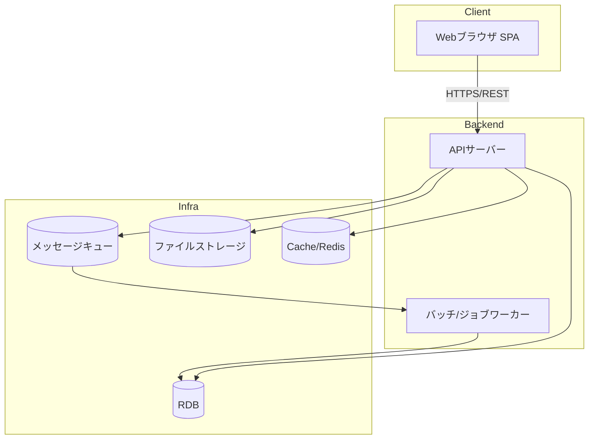
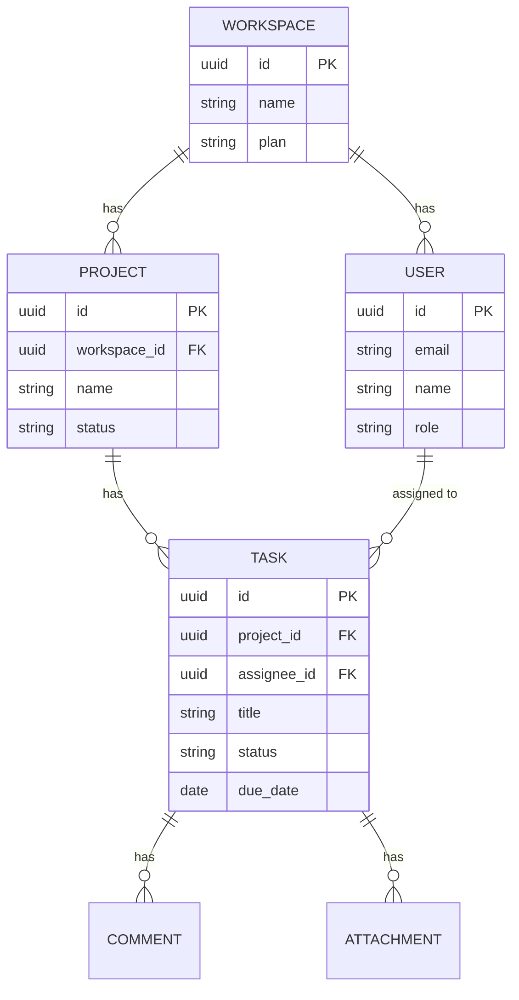
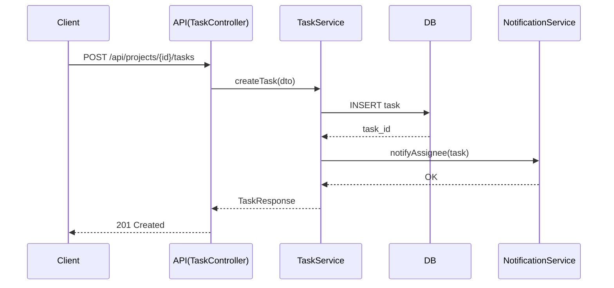

# 内部設計書

> ⚠️ **本資料はテンプレート（雛形）です。** 内容を変更して資料作成を開始する際は、このメッセージを削除してください。該当しない項目には「該当なし」と記載してください。

| 項目 | 内容 |
| --- | --- |
| プロジェクト名 | TaskFlow |
| 作成日 | [YYYY/MM/DD] |
| 版数 | v0.1 |
| 関連資料 | [外部設計書](../04_external-design/external-design.md)、[要件定義書](../02_requirements/requirements.md) |

## 1. 目的

外部設計書で定義した仕様を実現するための内部構造（アーキテクチャ、DB、API内部処理、モジュール構成）を定義する。

## 2. システムアーキテクチャ

| レイヤー | 技術（例） |
| --- | --- |
| フロントエンド | [React / TypeScript] |
| バックエンド | [Node.js(NestJS) / Java(Spring Boot) 等] |
| DB | [PostgreSQL] |
| キャッシュ | [Redis] |
| ファイルストレージ | [S3互換オブジェクトストレージ] |
| メッセージキュー | [SQS等] |
| インフラ | [クラウド事業者名] / コンテナ（[Kubernetes/ECS等]） |

## 3. モジュール構成

| モジュール | 責務 |
| --- | --- |
| auth | 認証・認可、トークン管理 |
| workspace | ワークスペース・招待・権限 |
| project | プロジェクトCRUD |
| task | タスクCRUD、ステータス管理 |
| notification | 通知生成・送信 |
| billing | プラン管理・請求連携 |
| report | 集計・エクスポート |

## 4. データベース設計

### 4.1 ER図（概略）

### 4.2 主要テーブル定義

#### tasks

| カラム名 | 型 | NULL | 説明 |
| --- | --- | --- | --- |
| id | uuid | NOT NULL | 主キー |
| project_id | uuid | NOT NULL | プロジェクトFK |
| assignee_id | uuid | NULL | 担当者FK |
| title | varchar(255) | NOT NULL | タスク名 |
| status | varchar(32) | NOT NULL | todo/doing/done等 |
| due_date | date | NULL | 期限 |
| created_at | timestamp | NOT NULL | 作成日時 |
| updated_at | timestamp | NOT NULL | 更新日時 |

> 他テーブル（users, workspaces, projects, comments, attachments等）も同様に定義する。

## 5. API内部処理設計（例：タスク作成）

## 6. エラーハンドリング方針

| 区分 | 方針 |
| --- | --- |
| 入力エラー | 400 Bad Request、フィールド単位のエラーメッセージ返却 |
| 認可エラー | 403 Forbidden |
| 未検出 | 404 Not Found |
| サーバーエラー | 500、エラーIDを返却しログに詳細記録 |
| 例外設計 | 業務例外/システム例外を分離し、共通ハンドラで変換 |

## 7. 非機能設計

| 項目 | 設計方針 |
| --- | --- |
| 性能 | 一覧APIはページネーション必須、N+1回避のためJOIN/バッチ取得 |
| キャッシュ | ワークスペース設定等の読み取り頻度が高い情報はCache層を利用 |
| セキュリティ | 認可はワークスペース単位でRBAC実装、SQLインジェクション対策（ORM/プレースホルダ使用） |
| ロギング | 構造化ログ（JSON）、リクエストIDで追跡可能に |
| スケーラビリティ | APIサーバーはステートレスとし水平スケール可能に |

## 8. バッチ・非同期処理

| 処理名 | トリガー | 概要 |
| --- | --- | --- |
| 期限通知バッチ | 日次スケジュール | 期限が近いタスクの担当者に通知 |
| レポート集計バッチ | 日次スケジュール | ダッシュボード用集計データ生成 |
| 請求処理 | 月次スケジュール | プラン利用量に応じた請求データ生成 |

## 9. 変更履歴

| 版数 | 日付 | 変更内容 | 作成者 |
| --- | --- | --- | --- |
| v0.1 | [YYYY/MM/DD] | 初版作成 | [氏名] |
