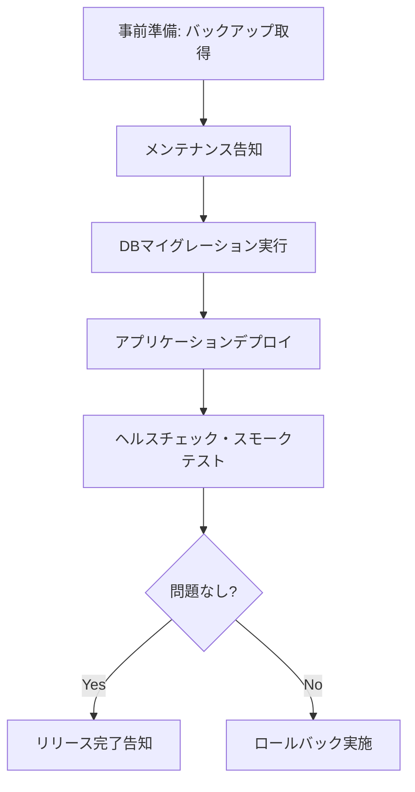

# リリース計画書

> ⚠️ **本資料はテンプレート（雛形）です。** 内容を変更して資料作成を開始する際は、このメッセージを削除してください。該当しない項目には「該当なし」と記載してください。

| 項目 | 内容 |
| --- | --- |
| プロジェクト名 | TaskFlow |
| 作成日 | [YYYY/MM/DD] |
| 関連資料 | [出荷判定資料](shipment-approval.md)、[出荷物一覧](deliverables-list.md) |

## 1. リリース概要

| 項目 | 内容 |
| --- | --- |
| リリース種別 | 新規サービスリリース（初回） |
| リリース日時 | [YYYY/MM/DD HH:MM]（想定所要[X]時間） |
| リリース方式 | [Blue-Green / ローリングアップデート / メンテナンス停止] |
| 対象環境 | 本番環境 |

## 2. リリース体制

| 役割 | 担当 | 連絡先 |
| --- | --- | --- |
| リリース責任者 | [氏名] | [連絡先] |
| デプロイ担当 | [氏名] | [連絡先] |
| 監視担当 | [氏名] | [連絡先] |
| 緊急連絡先（エスカレーション） | [氏名] | [連絡先] |

## 3. リリース手順

| No | 手順 | 担当 | 所要時間目安 |
| --- | --- | --- | --- |
| 1 | 本番DBバックアップ取得 | [氏名] | [分] |
| 2 | メンテナンス画面切替（必要な場合） | [氏名] | [分] |
| 3 | DBマイグレーション実行 | [氏名] | [分] |
| 4 | アプリケーションデプロイ | [氏名] | [分] |
| 5 | スモークテスト実施 | [氏名] | [分] |
| 6 | メンテナンス解除・リリース告知 | [氏名] | [分] |

## 4. スモークテスト項目

- [ ] ログインができる
- [ ] タスクの作成・表示ができる
- [ ] 通知が正常に送信される
- [ ] 主要APIのヘルスチェックがOKである

## 5. ロールバック計画

| 項目 | 内容 |
| --- | --- |
| ロールバック判断基準 | Critical障害発生、スモークテスト不合格 |
| ロールバック手順 | 直前バージョンのアプリケーションへ切り戻し、DBはバックアップからリストア（マイグレーションが不可逆の場合） |
| ロールバック所要時間目安 | [分] |
| ロールバック判断者 | [氏名（リリース責任者）] |

## 6. リリース後の監視項目

| 項目 | 監視期間 | 閾値 |
| --- | --- | --- |
| エラーレート | リリース後[24]時間 | [1]%以上でアラート |
| レスポンスタイム | リリース後[24]時間 | [2]秒以上でアラート |
| サーバーリソース（CPU/メモリ） | リリース後[24]時間 | [80]%以上でアラート |

## 7. 告知計画

| 対象 | タイミング | 手段 |
| --- | --- | --- |
| 社内 | リリース前日 | チャット/メール |
| 既存ユーザー | リリース当日 | メール/アプリ内通知 |
| 一般（プレスリリース等） | リリース後 | [広報チャネル] |

## 8. 承認

| 役割 | 氏名 | 承認日 |
| --- | --- | --- |
| リリース責任者 | [氏名] | [YYYY/MM/DD] |
| 開発責任者 | [氏名] | [YYYY/MM/DD] |
