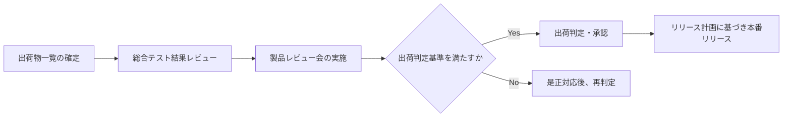

# 出荷判定資料

> ⚠️ **本資料はテンプレート（雛形）です。** 内容を変更して資料作成を開始する際は、このメッセージを削除してください。該当しない項目には「該当なし」と記載してください。

| 項目 | 内容 |
| --- | --- |
| プロジェクト名 | TaskFlow |
| 作成日 | [YYYY/MM/DD] |
| 版数 | v0.1 |
| 関連資料 | [出荷物一覧](deliverables-list.md)、[リリース計画書](release-plan.md)、[製品レビュー資料](../07_product-review/product-review.md) |

## 1. 目的

リリース対象成果物が出荷基準を満たしていることを認証し、正式なリリース承認を得るための資料とする。

## 2. 出荷判定基準

| 基準 | 内容 | 判定 |
| --- | --- | --- |
| 機能要件充足 | Must要件がすべて実装・テスト完了 | [ ] |
| 品質基準 | 重大・重要バグ0件（[総合テスト計画書](../08_comprehensive-testing/test-plan.md)のExit基準準拠） | [ ] |
| セキュリティ基準 | 脆弱性診断でCritical/High 0件 | [ ] |
| 資料整備 | 設計書・運用手順・リリース計画が最新化されている | [ ] |
| 承認 | 関係者全員の承認完了 | [ ] |

## 3. 判定プロセス

## 4. 出荷物

詳細は[出荷物一覧](deliverables-list.md)を参照。

## 5. リリース計画

詳細は[リリース計画書](release-plan.md)を参照。

## 6. 既知の問題・制限事項

| No | 内容 | 影響範囲 | 回避策 |
| --- | --- | --- | --- |
| 1 | [既知の軽微な不具合] | [範囲] | [回避策 / 次回パッチで対応] |

## 7. 承認（サインオフ）

| 役割 | 氏名 | 承認日 | 承認 |
| --- | --- | --- | --- |
| プロジェクトオーナー | [氏名] | [YYYY/MM/DD] | [ ] |
| 開発責任者 | [氏名] | [YYYY/MM/DD] | [ ] |
| QAマネージャー | [氏名] | [YYYY/MM/DD] | [ ] |
| 運用責任者 | [氏名] | [YYYY/MM/DD] | [ ] |

## 8. 変更履歴

| 版数 | 日付 | 変更内容 | 作成者 |
| --- | --- | --- | --- |
| v0.1 | [YYYY/MM/DD] | 初版作成 | [氏名] |
